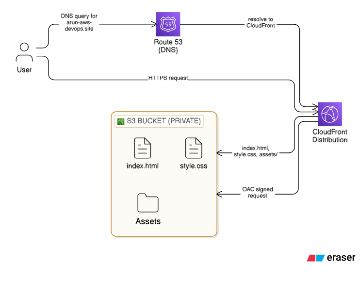
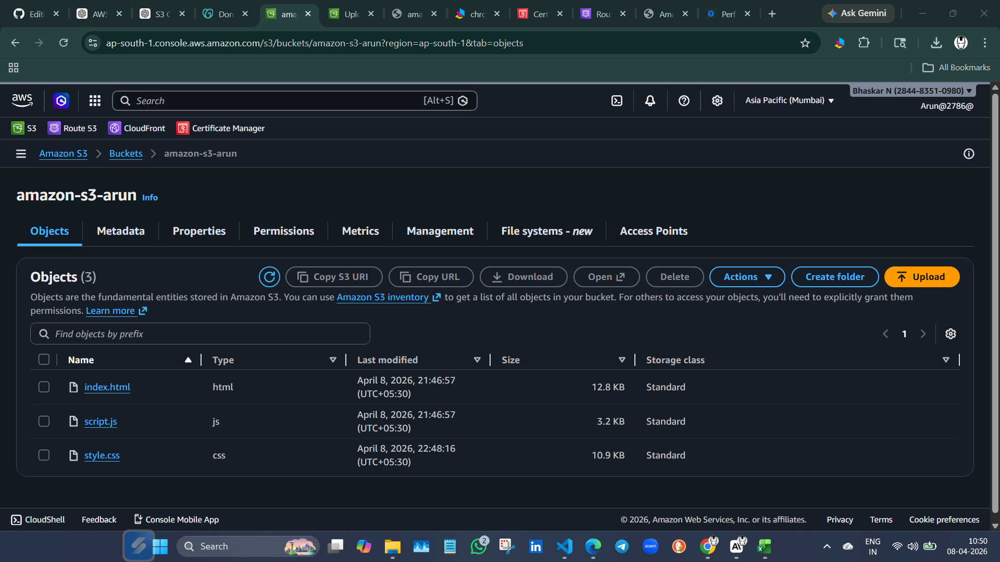
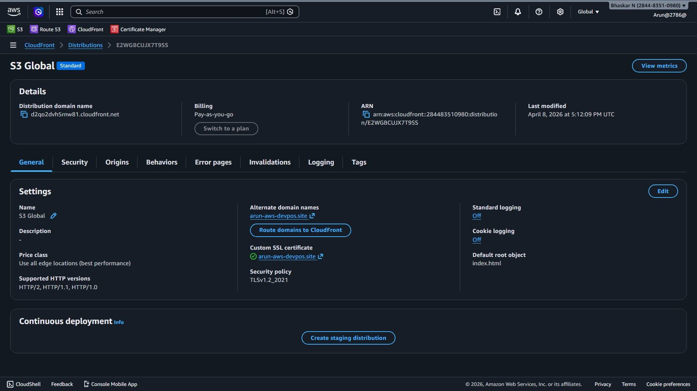
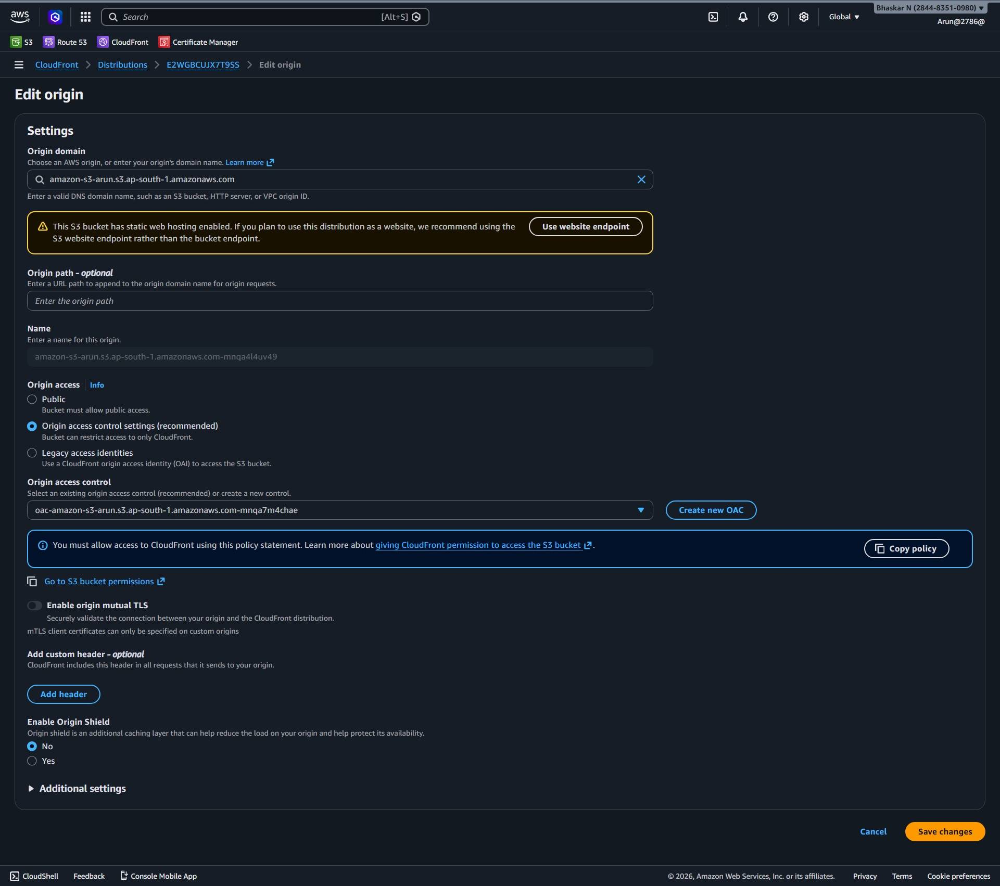
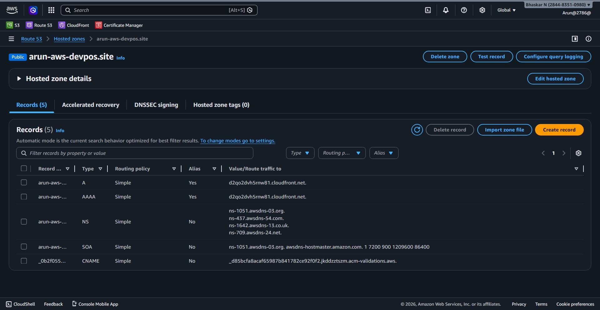
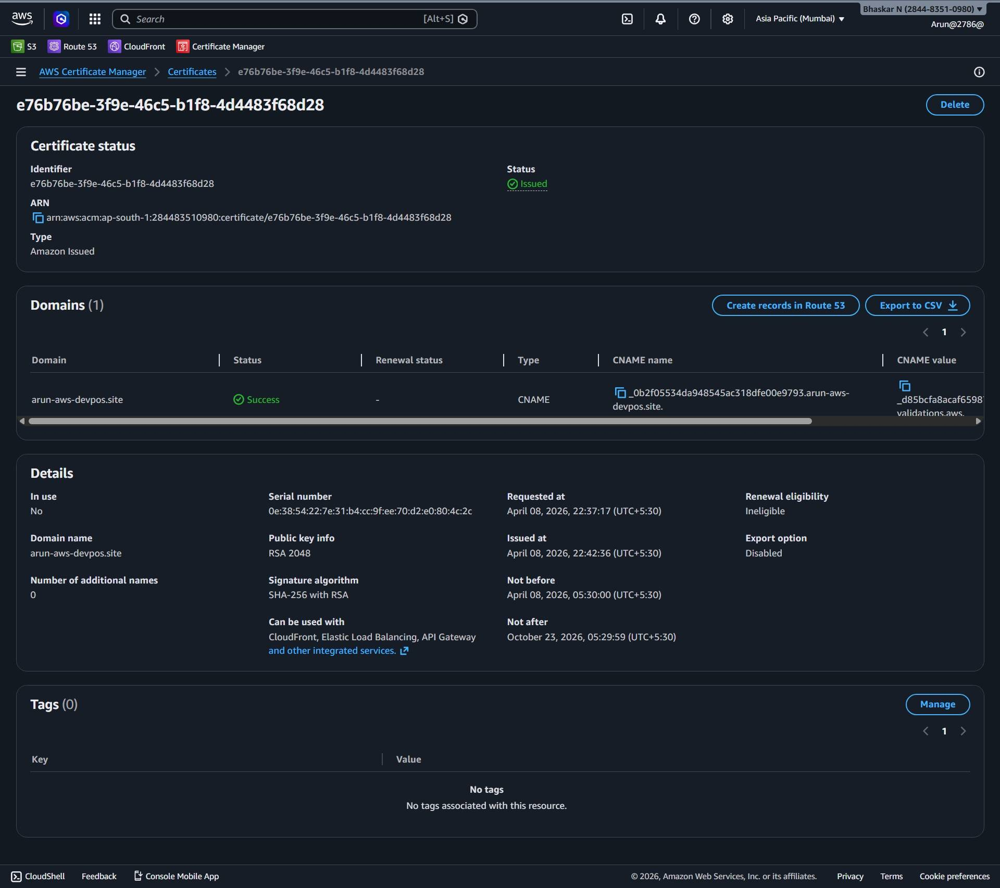
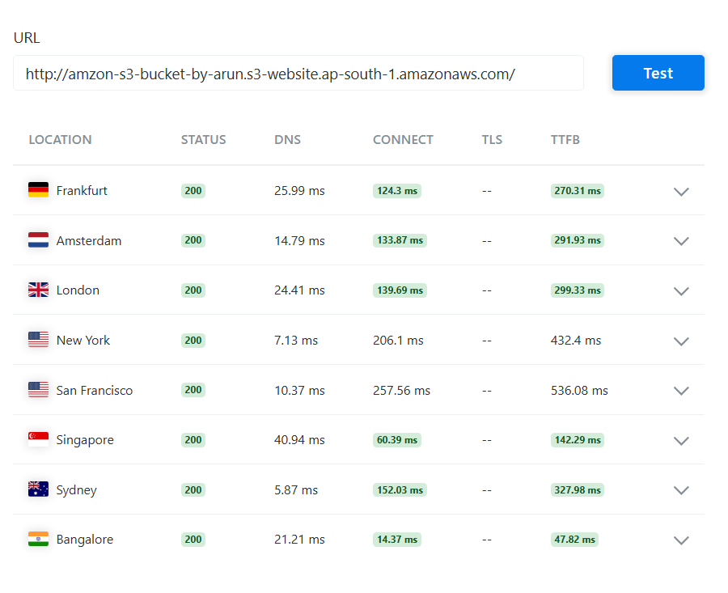
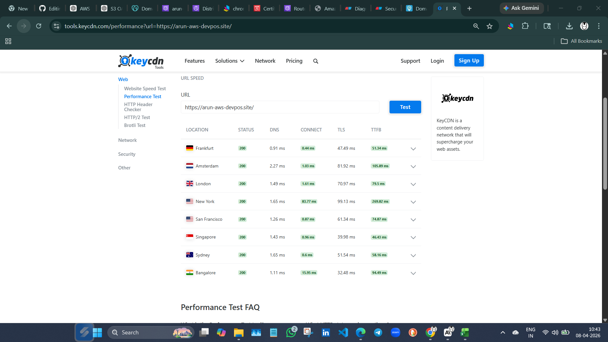
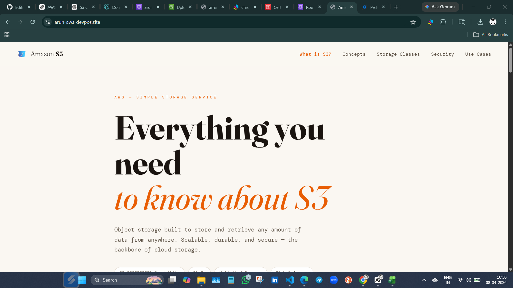
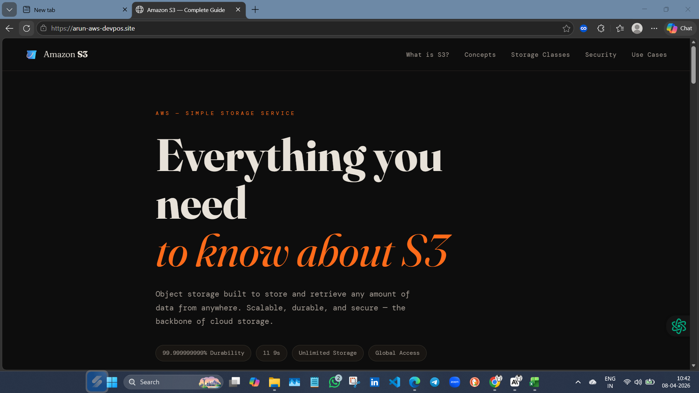

# 🌐 Static Website Hosting on AWS

A production-ready static website deployed on AWS using S3, CloudFront, Route 53, and ACM — with HTTPS, custom domain, and global CDN delivery.

## 🚀 AWS Services Used

| Service | Purpose |
|---|---|
| **Amazon S3** | Store and host static website files |
| **Amazon CloudFront** | CDN for fast and secure global delivery |
| **Amazon Route 53** | Custom domain and DNS management |
| **AWS Certificate Manager** | Free SSL/TLS certificate for HTTPS |

## 🏗️ Architecture
<p align="center">
  
</p>

- S3 bucket is **fully private** — no public access
- CloudFront uses **OAC (Origin Access Control)** to securely fetch from S3
- Route 53 routes the custom domain to CloudFront
- ACM provides a **free SSL certificate** — HTTPS enforced

# ⚙️ Setup Steps
## 1. Create S3 Bucket
- Create an S3 bucket
- Upload static website files (index.html, CSS, JS)
- Keep bucket private
  
<p align="center">
  
</p>

## 2. 🌐 Configure CloudFront (CDN)

1. Create a CloudFront distribution and set the origin to your S3 bucket.  
2. Enable **Origin Access Control (OAC)** so CloudFront can securely fetch files from the private bucket.  
3. Set `index.html` as the **Default Root Object** for proper routing.  
4. Redirect all traffic to **HTTPS** and attach an SSL certificate via AWS Certificate Manager.  
5. Configure caching policies for faster global delivery and lower latency.  
6. Point your custom domain in Route53 to the CloudFront distribution using an Alias record.

<p align="center">
  
  
</p>

## 3.🔒 Configure Bucket Policy
1. Keep the bucket private — do not allow public access.
2. Create an Origin Access Control (OAC) in CloudFront.
3. Attach the OAC to your distribution so CloudFront can fetch objects securely.
4. Update the S3 bucket policy to allow access only from CloudFront using the OAC’s principal.
5. This ensures that users cannot bypass CloudFront and directly access your S3 bucket.

Allow only CloudFront to access the S3 bucket securely.

```json
{
  "Version": "2008-10-17",
  "Id": "PolicyForCloudFrontPrivateContent",
  "Statement": [
    {
      "Sid": "AllowCloudFrontServicePrincipal",
      "Effect": "Allow",
      "Principal": {
        "Service": "cloudfront.amazonaws.com"
      },
      "Action": "s3:GetObject",
      "Resource": "arn:aws:s3:::amazon-s3-arun/*",
      "Condition": {
        "StringEquals": {
          "AWS:SourceArn": "arn:aws:cloudfront::284485351098:distribution/E2WGBCUK7Y55S"
        }
      }
    }
  ]
}
```
## 4. Configure Domain (Route 53)

- Created a Hosted Zone for my custom domain. (e.g., `arun-aws-devpos.site`).  
- Added an **A Record** with **Alias → CloudFront Distribution**.  
- This ensures my domain points to CloudFront, serving content globally.  
- I verified DNS propagation and tested my domain in the browser with HTTPS..

<p align="center">
  
</p>

## 5. Request Certificate in ACM
- I requested a public SSL/TLS certificate for my custom domain (e.g., `arun-aws-devpos.site`).  
- I validated the domain ownership using DNS validation in Route 53.  
- Once the certificate was issued, I attached it to my CloudFront distribution.  
- This enabled **HTTPS** for my website, ensuring secure communication.
  
<p align="center">
  
</p>

## 6. CDN Performance Test

- I performed a CDN performance test after configuring CloudFront.  
- I measured latency and response times from multiple regions.  
- I confirmed that CloudFront cached my static assets at edge locations.  
- The results showed faster load times compared to direct S3 access.  
- I validated that HTTPS was working correctly with the ACM certificate.  
- Overall, the CDN improved global delivery and reduced latency significantly.

<p align="center">
  
  
</p>

---
## 7. CloudFront Invalidations

- I updated my static website files (HTML, CSS, JS) in the S3 bucket.  
- Since CloudFront caches content at edge locations, I created an **Invalidation** to refresh the cache.  
- In the CloudFront console, I went to **Invalidations → Create Invalidation**.  
- I entered the path `/*` to clear all cached objects (or specific file paths like `/index.html`).  
- This ensured that users immediately saw the updated content across all regions.  
- Invalidations may take a few minutes to propagate globally.


| Test Result 1 | Test Result 2 |
| :---: | :---: |
|  |  |


## 🐛 Troubleshooting

Real issues encountered and fixed during this project.

---

### Problem 1 — 403 Access Denied on CloudFront

**Symptom:**
```
403 Forbidden
Code: AccessDenied
Message: Access Denied
```

**Root Cause:**
Two misconfigurations found:

1. **Origin Access was set to "Public"** — CloudFront was not using OAC even though the bucket policy was already configured for it. Because origin was set to Public, CloudFront expected the bucket to allow public access directly, which it didn't.

2. **Wrong region in origin domain** — The CloudFront origin was pointing to `eu-north-1` but the bucket was in a different region, causing routing failures.

**Fix:**

Step 1 — In CloudFront → Origins → Edit, change Origin Access:
```
❌ Public
✅ Origin access control settings (recommended)
```
Select your OAC or create a new one. CloudFront will generate a new bucket policy — copy and apply it.

Step 2 — Verify origin domain matches actual bucket region:
```
✅ s3-project-by-arun.s3.ap-south-1.amazonaws.com  ← REST endpoint
❌ s3-project-by-arun.s3-website.ap-south-1.amazonaws.com  ← website endpoint (OAC won't work)
```

Step 3 — Invalidate cache:
```
CloudFront → Invalidations → Create → /*
```

**Lesson Learned:**
> Setting the bucket policy for OAC is not enough. CloudFront origin must also be explicitly set to use OAC — otherwise CloudFront never sends the signed headers and S3 denies every request.

---

### Problem 2 — Root URL 403 but `/index.html` Works

**Symptom:**
```
https://arun-aws-devops.site        ❌ 403
https://arun-aws-devops.site/index.html  ✅ 200
```

**Root Cause:**
CloudFront had no **Default Root Object** configured. When a user visits the root URL `/`, CloudFront doesn't know which file to serve from S3 — so it returns 403.

**Fix:**

Step 1 — Set Default Root Object:
```
CloudFront → Your Distribution → Settings → Edit
Default Root Object → index.html
Save changes
```

Step 2 — Invalidate cache:
```
Invalidations → Create → /*
```
**Lesson Learned:**
> Always set `index.html` as the Default Root Object when hosting a static site on CloudFront + S3. Without it, the root URL will silently fail even if everything else is configured correctly.

---
# 🏁 Conclusion

- I successfully hosted a static website using **Amazon S3**, **CloudFront CDN**, and **Route53 DNS**.  
- I kept the S3 bucket private and configured a bucket policy to allow access only through CloudFront.  
- I integrated **SSL/TLS certificates** via ACM to enable secure HTTPS connections.  
- I mapped my custom domain using Route53 with an Alias record pointing to CloudFront.  
- I performed CDN performance tests and confirmed improved latency, caching efficiency, and global delivery.  
- Overall, this project demonstrates a secure, scalable, and globally distributed static website hosting solution on AWS.


